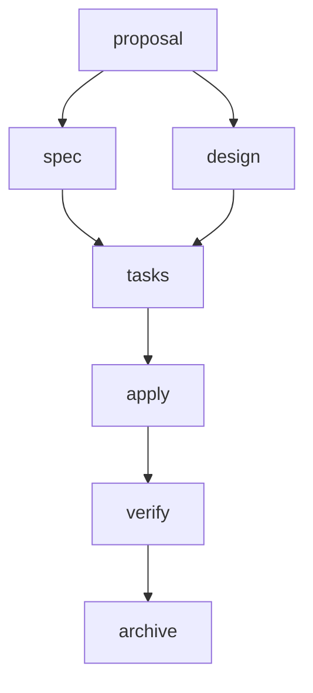

## Overview

Gentle AI configures 8 ecosystem components. Each component is optional and can be selected individually or via presets.

<CardGroup cols={2}>
  <Card title="Engram" icon="brain">
    Persistent cross-session memory
  </Card>
  <Card title="SDD" icon="diagram-project">
    Spec-Driven Development workflow
  </Card>
  <Card title="Skills" icon="book">
    Curated coding skill library
  </Card>
  <Card title="Context7" icon="search">
    MCP server for live documentation
  </Card>
  <Card title="Persona" icon="user">
    Behavior and teaching mode
  </Card>
  <Card title="Permissions" icon="shield">
    Security-first guardrails
  </Card>
  <Card title="GGA" icon="wand-magic-sparkles">
    AI provider switcher
  </Card>
  <Card title="Theme" icon="palette">
    Gentleman Kanagawa theme overlay
  </Card>
</CardGroup>

## Component Details

### Engram

**Persistent cross-session memory that survives context resets.**

Engram is a memory protocol that allows AI agents to:
- Save important context (architecture decisions, bug fixes, conventions)
- Retrieve prior knowledge across sessions
- Build long-term understanding of your projects

#### How It Works

<Steps>
  <Step title="Memory Storage">
    Agents use `mem_save()` to persist:
    - Project context and architecture
    - Design decisions with rationale
    - Bug investigations and solutions
    - Coding patterns and conventions
  </Step>
  
  <Step title="Memory Retrieval">
    Agents use `mem_search()` to find:
    - Relevant prior context
    - Past decisions
    - Known issues and solutions
  </Step>
  
  <Step title="Context Recovery">
    When context is lost (compaction, new session):
    - Agent searches engram for state
    - Recovers SDD artifacts
    - Restores project understanding
  </Step>
</Steps>

#### Configuration

Engram protocol instructions are injected into:
- **Claude Code**: `~/.claude/CLAUDE.md` (via markers)
- **OpenCode**: `~/.config/opencode/AGENTS.md`
- **Gemini CLI**: `~/.gemini/GEMINI.md` (via markers)
- **Cursor**: `~/.cursor/CURSOR.md` (via markers)
- **VS Code Copilot**: `Code/User/prompts/gentle-ai.instructions.md`

#### Topic Key Format

Engram uses hierarchical topic keys for SDD artifacts:

```
sdd-init/{project}                 ← Project context
sdd/{change-name}/explore          ← Exploration notes
sdd/{change-name}/proposal         ← Change proposal
sdd/{change-name}/spec             ← Specifications
sdd/{change-name}/design           ← Technical design
sdd/{change-name}/tasks            ← Task breakdown
sdd/{change-name}/apply-progress   ← Implementation status
sdd/{change-name}/verify-report    ← Verification results
sdd/{change-name}/archive-report   ← Archive summary
```

<Info>
Engram is the **default persistence backend** for SDD workflows when available. Projects can opt into file-based persistence (`openspec`) or use both (`hybrid`).
</Info>

---

### SDD

**Spec-Driven Development workflow with 9 structured phases.**

SDD (Spec-Driven Development) is a planning-first methodology that prevents premature implementation:

<Steps>
  <Step title="Explore">
    Investigate the codebase to understand:
    - Current architecture
    - Related code and patterns
    - Potential impact areas
  </Step>
  
  <Step title="Propose">
    Create a change proposal with:
    - Intent and motivation
    - Scope boundaries
    - High-level approach
    - Rollback plan
  </Step>
  
  <Step title="Specify">
    Write detailed specifications:
    - Functional requirements (RFC 2119)
    - Given/When/Then scenarios
    - Edge cases and error handling
  </Step>
  
  <Step title="Design">
    Technical design decisions:
    - Architecture changes
    - Data structures
    - API contracts
    - Sequence diagrams
  </Step>
  
  <Step title="Break Down">
    Task decomposition:
    - Hierarchical task list
    - Phase grouping (infrastructure, implementation, testing)
    - Dependency tracking
  </Step>
  
  <Step title="Apply">
    Implementation in batches:
    - Follow specs and design
    - Track progress
    - Update apply-progress artifact
  </Step>
  
  <Step title="Verify">
    Validation against specs:
    - Run tests
    - Compare implementation to scenarios
    - Document deviations
  </Step>
  
  <Step title="Archive">
    Clean up and finalize:
    - Sync delta specs to main specs
    - Archive completed change
    - Generate summary
  </Step>
</Steps>

#### Configuration

The **SDD orchestrator** (agent-teams-lite) is injected as part of system prompt configuration. It provides:
- Meta-commands (`/sdd-new`, `/sdd-continue`, `/sdd-ff`)
- Sub-agent delegation rules
- Artifact dependency graph
- Persistence backend selection (engram/openspec/hybrid/none)

#### Dependency Graph



<Warning>
SDD requires the **Skills** component to function — each phase is implemented as a separate skill file.
</Warning>

---

### Skills

**Curated coding skill library with 11 pre-built skills.**

Skills are markdown files (SKILL.md format) that provide:
- Detailed instructions for specific tasks
- Context detection triggers
- Best practices and patterns
- Framework-specific conventions

#### Skill Categories

<Accordion title="SDD Skills (9 skills)">
| Skill | Description |
|-------|-------------|
| sdd-init | Bootstrap SDD context in a project |
| sdd-explore | Investigate codebase before committing to a change |
| sdd-propose | Create change proposal with intent, scope, approach |
| sdd-spec | Write specifications with requirements and scenarios |
| sdd-design | Technical design with architecture decisions |
| sdd-tasks | Break down a change into implementation tasks |
| sdd-apply | Implement tasks following specs and design |
| sdd-verify | Validate implementation matches specs |
| sdd-archive | Sync delta specs to main specs and archive |

These skills form the complete SDD workflow when used with the orchestrator.
</Accordion>

<Accordion title="Foundation Skills (2 skills)">
| Skill | Description |
|-------|-------------|
| go-testing | Go testing patterns including Bubbletea TUI testing |
| skill-creator | Create new AI agent skills following the Agent Skills spec |

Foundation skills are installed by default with both `full-gentleman` and `ecosystem-only` presets.
</Accordion>

#### Installation Paths

Skills are copied to agent-specific directories:

- **Claude Code**: `~/.claude/skills/`
- **OpenCode**: `~/.config/opencode/skills/`
- **Gemini CLI**: `~/.gemini/skills/`
- **Cursor**: `~/.cursor/skills/`
- **VS Code Copilot**: `~/.copilot/skills/` (global only)

#### Auto-Loading

Agents auto-load skills based on context:

```markdown
---
name: go-testing
description: Go testing patterns
trigger: When writing Go tests or testing Bubbletea TUI
---
```

When the agent detects Go test files or TUI code, it loads the `go-testing` skill automatically.

---

### Context7

**MCP server for real-time framework and library documentation.**

Context7 is an npm-based MCP (Model Context Protocol) server that provides:
- Live documentation for popular frameworks (React, Next.js, etc.)
- API references without hallucination
- Up-to-date examples from official docs

#### Installation

Context7 is installed globally via npm:

```bash
npm install -g @context7/mcp
```

<Note>
On systems where npm global prefix is not user-writable, Gentle AI will guide you to fix permissions or use a node version manager (nvm/fnm/volta).
</Note>

#### Configuration Strategy

Each agent uses a different MCP configuration approach:

| Agent | Strategy | Path |
|-------|----------|------|
| Claude Code | Separate JSON files | `~/.claude/mcp/context7.json` |
| OpenCode | Merged into settings | `~/.config/opencode/settings.json` |
| Gemini CLI | Merged into settings | `~/.gemini/settings.json` |
| Cursor | Single config file | `~/.cursor/mcp.json` |
| VS Code Copilot | Merged into MCP config | `Code/User/mcp.json` |

#### Example Config

```json
{
  "mcpServers": {
    "context7": {
      "command": "npx",
      "args": ["-y", "@context7/mcp"],
      "env": {}
    }
  }
}
```

---

### Persona

**Behavior and teaching mode configuration.**

Persona instructions shape how your agent communicates and teaches:

<Tabs>
  <Tab title="Gentleman">
    **Teaching-oriented mentor persona**
    
    Characteristics:
    - Pushes back on bad practices
    - Explains the "why" behind decisions
    - Uses direct, confrontational language
    - Focuses on concepts over code
    - References Iron Man/Jarvis analogies
    - Speaks Spanish or English based on input
    
    Example rules:
    - "NEVER agree with user claims without verification"
    - "If user is wrong, explain WHY with evidence"
    - "Push back when user asks for code without understanding"
    - "CONCEPTS > CODE: Call out tutorial programmers"
  </Tab>
  
  <Tab title="Neutral">
    **Clean, professional tone**
    
    Characteristics:
    - No personality or opinions
    - Factual and objective
    - Standard technical communication
    - Executes requests without pushback
  </Tab>
  
  <Tab title="Custom">
    **Bring your own persona**
    
    You provide:
    - Custom system prompt additions
    - Behavior rules
    - Communication style
    - Domain expertise
  </Tab>
</Tabs>

#### Configuration Files

Persona instructions are embedded in the SDD orchestrator or loaded separately depending on the agent.

---

### Permissions

**Security-first defaults and guardrails.**

Permissions component injects security rules:

- Never commit without explicit user request
- Never run destructive git commands (force push, hard reset)
- Never skip hooks (`--no-verify`, `--no-gpg-sign`)
- Never add AI attribution to commits
- Always use conventional commit format
- Ask before running builds or deployments

These rules are part of the system prompt injection.

---

### GGA

**Gentleman Guardian Angel — AI provider switcher.**

GGA is a standalone binary that enables multi-model workflows:

- Switch between AI providers per repository
- Manage API keys and endpoints
- Track usage and costs
- Automatic model selection based on task

#### Installation

```bash
gentle-ai install --component gga
```

This installs the `gga` binary globally but **does not** run project-level setup.

#### Per-Project Enablement

```bash
cd your-project
gga init
gga install
```

<Warning>
GGA setup is **opt-in per repository** — it should be an explicit decision, not automatic.
</Warning>

---

### Theme

**Gentleman Kanagawa theme overlay (future component).**

The theme component will provide:
- Visual style customization
- Syntax highlighting themes
- Terminal color schemes

Currently a placeholder for future development.

---

## Component Dependencies

Some components depend on others:

```
engram          (no dependencies)
sdd             → requires engram
skills          → requires sdd
context7        (no dependencies)
persona         (no dependencies)
permissions     (no dependencies)
gga             (no dependencies)
theme           (no dependencies)
```

The planner automatically resolves transitive dependencies:

- Select `skills` → installs `engram`, `sdd`, `skills`
- Select `sdd` → installs `engram`, `sdd`

## Next Steps

<CardGroup cols={2}>
  <Card
    title="Agents"
    icon="robot"
    href="/concepts/agents"
  >
    Understand agent support and strategies
  </Card>
  <Card
    title="Presets Guide"
    icon="sliders"
    href="/guides/presets"
  >
    Learn about preset configurations
  </Card>
  <Card
    title="Skills Guide"
    icon="book"
    href="/guides/skills"
  >
    Deep dive into SDD skills
  </Card>
  <Card
    title="Interactive Mode"
    icon="terminal"
    href="/guides/interactive-mode"
  >
    Master the TUI workflow
  </Card>
</CardGroup>
