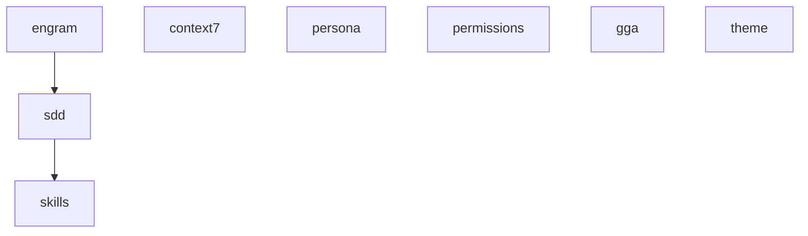

## Overview

Presets are curated combinations of components and skills designed for common use cases. They simplify configuration by bundling related features together.

<CardGroup cols={2}>
  <Card title="Full Gentleman" icon="star">
    Complete ecosystem - recommended
  </Card>
  <Card title="Ecosystem Only" icon="diagram-project">
    SDD workflow focused
  </Card>
  <Card title="Minimal" icon="minimize">
    Memory and security only
  </Card>
  <Card title="Custom" icon="sliders">
    Build your own combination
  </Card>
</CardGroup>

## Preset Comparison

| Feature | Full Gentleman | Ecosystem Only | Minimal | Custom |
|---------|---------------|----------------|---------|--------|
| **Components** | All 8 | 5 core | 3 essential | You pick |
| **Skills** | All 11 | 11 P0 | None | You pick |
| **Persona** | Gentleman | Gentleman | Gentleman | You pick |
| **Use Case** | Most users | Workflow focus | Lightweight | Advanced |

## Full Gentleman

**The complete Gentle AI ecosystem - recommended for most users.**

### What's Included

<Tabs>
  <Tab title="Components (8)">
    All ecosystem components:
    
    - **engram** — Persistent cross-session memory
    - **sdd** — Spec-Driven Development workflow orchestrator
    - **skills** — Curated coding skill library
    - **context7** — MCP server for live framework documentation
    - **persona** — Gentleman teaching mode
    - **permissions** — Security-first guardrails
    - **gga** — AI provider switcher
    - **theme** — Gentleman Kanagawa theme overlay (future)
  </Tab>
  
  <Tab title="Skills (11)">
    Complete skill library:
    
    **SDD Workflow (9 skills)**:
    - sdd-init
    - sdd-explore
    - sdd-propose
    - sdd-spec
    - sdd-design
    - sdd-tasks
    - sdd-apply
    - sdd-verify
    - sdd-archive
    
    **Foundation (2 skills)**:
    - go-testing
    - skill-creator
  </Tab>
  
  <Tab title="Persona">
    **Gentleman mode** (teaching-oriented mentor):
    
    - Pushes back on bad practices
    - Explains the "why" behind decisions
    - Uses direct, confrontational language
    - Focuses on concepts over code
    - Adapts to Spanish or English input
  </Tab>
</Tabs>

### Installation

<CodeGroup>

```bash CLI
gentle-ai install --agent claude-code --preset full-gentleman
```

```bash TUI
gentle-ai
# Select "Full Gentleman" in the Preset screen
```

</CodeGroup>

### Dependencies Installed

- **npm packages**: `@context7/mcp` (global)
- **Go binaries**: `gga` (via `go install`)
- **System tools**: None (git, curl, node, npm are prerequisites)

### Agent Configuration

For each selected agent:
- System prompt injection with SDD orchestrator + persona
- 11 skill files in `skills/` directory
- MCP server configuration for Context7
- Security permissions and guardrails

<Info>
**Recommended for**: New users, learning-focused developers, teams adopting SDD workflow.
</Info>

---

## Ecosystem Only

**Core SDD workflow without extra components.**

### What's Included

<Tabs>
  <Tab title="Components (5)">
    Core workflow components:
    
    - **engram** — Persistent cross-session memory
    - **sdd** — Spec-Driven Development workflow
    - **skills** — Curated coding skill library
    - **context7** — MCP server for live documentation
    - **gga** — AI provider switcher
    
    **Excluded**:
    - ~~persona~~ (uses default agent behavior)
    - ~~permissions~~ (no security guardrails)
    - ~~theme~~ (no visual customization)
  </Tab>
  
  <Tab title="Skills (11)">
    All P0 skills:
    
    **SDD Workflow (9 skills)**:
    - sdd-init, sdd-explore, sdd-propose
    - sdd-spec, sdd-design, sdd-tasks
    - sdd-apply, sdd-verify, sdd-archive
    
    **Foundation (2 skills)**:
    - go-testing
    - skill-creator
  </Tab>
  
  <Tab title="Persona">
    **Gentleman mode** (same as Full Gentleman)
    
    Even though the `persona` component is excluded, the Gentleman behavior is still applied via system prompt injection.
  </Tab>
</Tabs>

### Installation

<CodeGroup>

```bash CLI
gentle-ai install --agent opencode --preset ecosystem-only
```

```bash TUI
gentle-ai
# Select "Ecosystem Only" in the Preset screen
```

</CodeGroup>

### Differences from Full Gentleman

| Feature | Full Gentleman | Ecosystem Only |
|---------|---------------|----------------|
| Permissions guardrails | ✓ Yes | ✗ No |
| Theme overlay | ✓ Yes (future) | ✗ No |
| SDD workflow | ✓ Yes | ✓ Yes |
| Context7 MCP | ✓ Yes | ✓ Yes |
| GGA switcher | ✓ Yes | ✓ Yes |

<Info>
**Recommended for**: Experienced developers who want the SDD workflow without additional guardrails.
</Info>

---

## Minimal

**Lightweight setup with memory and security only.**

### What's Included

<Tabs>
  <Tab title="Components (3)">
    Essential components only:
    
    - **engram** — Persistent cross-session memory
    - **persona** — Gentleman teaching mode
    - **permissions** — Security-first guardrails
    
    **Excluded**:
    - ~~sdd~~ (no workflow orchestrator)
    - ~~skills~~ (no skill files)
    - ~~context7~~ (no MCP server)
    - ~~gga~~ (no provider switcher)
    - ~~theme~~ (no visual customization)
  </Tab>
  
  <Tab title="Skills (0)">
    **No skills installed.**
    
    The minimal preset focuses on memory and behavior, not workflow.
  </Tab>
  
  <Tab title="Persona">
    **Gentleman mode** (teaching-oriented mentor)
    
    Same persona as Full Gentleman, but without SDD workflow context.
  </Tab>
</Tabs>

### Installation

<CodeGroup>

```bash CLI
gentle-ai install --agent cursor --preset minimal
```

```bash TUI
gentle-ai
# Select "Minimal" in the Preset screen
```

</CodeGroup>

### Use Cases

- **Quick setup**: Just want memory persistence
- **Lightweight**: Don't need the SDD workflow
- **Custom workflow**: Planning to add your own skills later
- **Testing**: Verify agent configuration without heavy components

<Info>
**Recommended for**: Users who want memory and security without the full SDD workflow.
</Info>

---

## Custom

**Build your own combination of components and skills.**

### How It Works

<Steps>
  <Step title="Select Custom Preset">
    Choose "Custom" in the TUI or CLI.
  </Step>
  
  <Step title="Pick Components">
    Individually select components:
    
    - engram (persistent memory)
    - sdd (workflow orchestrator)
    - skills (skill library)
    - context7 (MCP server)
    - persona (behavior mode)
    - permissions (security guardrails)
    - gga (provider switcher)
    - theme (visual customization)
  </Step>
  
  <Step title="Pick Skills (Optional)">
    If you selected the `skills` component, choose individual skills:
    
    - SDD: sdd-init, sdd-explore, sdd-propose, etc.
    - Foundation: go-testing, skill-creator
  </Step>
  
  <Step title="Choose Persona">
    Select behavior mode:
    
    - gentleman (teaching-oriented)
    - neutral (professional tone)
    - custom (your own instructions)
  </Step>
</Steps>

### CLI Syntax

```bash
gentle-ai install \
  --agent claude-code \
  --preset custom \
  --component engram,sdd,skills,context7 \
  --skill go-testing,skill-creator \
  --persona gentleman
```

<Warning>
With `--preset custom`, you **must** specify:
- At least one component via `--component`
- Optionally skills via `--skill` (only if `skills` component is selected)
- Optionally persona via `--persona` (defaults to `gentleman`)
</Warning>

### TUI Experience

In the TUI, Custom preset enables component toggle mode:

```text
Select Components (Space to toggle):

  [✓] engram
  [✓] sdd
  [✓] skills
  [ ] context7
  [✓] persona
  [ ] permissions
  [ ] gga
  [ ] theme

  > Continue
    Back
```

### Dependency Resolution

The planner automatically resolves dependencies:

**Example**: Selecting only `skills`

```bash
gentle-ai install --agent claude-code --preset custom --component skills
```

Actually installs:
```
engram      (dependency of sdd)
sdd         (dependency of skills)
skills      (selected)
```

<Info>
You don't need to manually select dependencies — the planner handles it automatically.
</Info>

### Common Custom Combinations

<Accordion title="SDD Workflow Only">
```bash
gentle-ai install \
  --agent claude-code \
  --preset custom \
  --component engram,sdd,skills \
  --persona gentleman
```

Core SDD workflow without MCP or GGA.
</Accordion>

<Accordion title="MCP Only">
```bash
gentle-ai install \
  --agent opencode \
  --preset custom \
  --component context7 \
  --persona neutral
```

Just the Context7 MCP server, no memory or skills.
</Accordion>

<Accordion title="Memory + Security">
```bash
gentle-ai install \
  --agent cursor \
  --preset custom \
  --component engram,permissions \
  --persona gentleman
```

Persistent memory with security guardrails, no workflow.
</Accordion>

<Accordion title="Everything Except GGA">
```bash
gentle-ai install \
  --agent claude-code \
  --preset custom \
  --component engram,sdd,skills,context7,persona,permissions \
  --persona gentleman
```

Full Gentleman minus GGA.
</Accordion>

---

## Component Dependencies

Understanding component dependencies helps with custom configurations:



**Dependency rules**:
- `sdd` requires `engram`
- `skills` requires `sdd` (which requires `engram`)
- All other components are independent

<Tip>
When selecting components, the planner automatically includes dependencies. You only need to specify top-level components.
</Tip>

---

## Preset Selection Guide

### Choose Full Gentleman if you want:

- Complete ecosystem experience
- Teaching-oriented agent behavior
- Security guardrails and permissions
- SDD workflow with all skills
- MCP servers and GGA switcher

### Choose Ecosystem Only if you want:

- SDD workflow without extras
- No security guardrails (handle manually)
- Lighter system prompt injection
- Full skill library

### Choose Minimal if you want:

- Just memory persistence
- Gentleman persona without workflow
- Security permissions
- Lightweight setup for testing

### Choose Custom if you want:

- Specific component combinations
- Fine-grained control
- Non-standard configurations
- To exclude specific components

---

## Modifying Presets

You can modify a preset selection before installation:

### TUI

After selecting a preset, you'll see the dependency tree screen where you can:
- Review included components
- Toggle components on/off (Custom preset only)
- See install order

### CLI

Override preset components:

```bash
# Start with ecosystem-only, add permissions
gentle-ai install \
  --agent claude-code \
  --preset ecosystem-only \
  --component permissions

# Start with full-gentleman, remove gga
gentle-ai install \
  --agent claude-code \
  --preset full-gentleman \
  --component -gga  # Note: This is not supported - use custom preset instead
```

<Warning>
CLI mode does not support removing components from presets. To exclude components, use `--preset custom` with explicit `--component` flags.
</Warning>

---

## Next Steps

<CardGroup cols={2}>
  <Card
    title="Interactive Mode"
    icon="terminal"
    href="/guides/interactive-mode"
  >
    Learn the TUI workflow
  </Card>
  <Card
    title="CLI Mode"
    icon="code"
    href="/guides/cli-mode"
  >
    Master command-line flags
  </Card>
  <Card
    title="Components"
    icon="puzzle-piece"
    href="/concepts/components"
  >
    Deep dive into each component
  </Card>
  <Card
    title="Skills"
    icon="book"
    href="/guides/skills"
  >
    Understanding SDD skills
  </Card>
</CardGroup>
