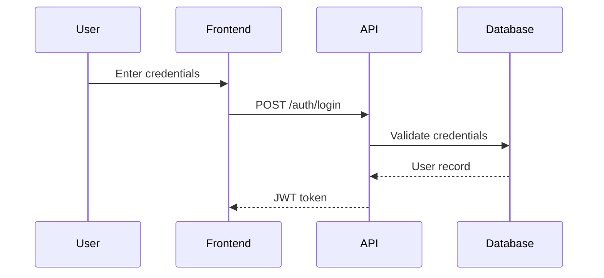

## Overview

Skills are markdown files that provide detailed instructions, patterns, and workflows for AI agents. Gentle AI includes 11 pre-built skills organized into two categories:

<CardGroup cols={2}>
  <Card title="SDD Skills" icon="diagram-project">
    9 skills forming the complete Spec-Driven Development workflow
  </Card>
  <Card title="Foundation Skills" icon="code">
    2 general-purpose coding skills for testing and skill creation
  </Card>
</CardGroup>

## Skill Format

Each skill is a markdown file with YAML frontmatter:

```markdown
---
name: skill-name
description: What this skill does and when to use it
license: MIT
metadata:
  author: gentleman-programming
  version: "2.0"
---

## Purpose
[What this skill accomplishes]

## Execution
[Step-by-step instructions]

## Rules
[Critical constraints and guidelines]
```

<Info>
Skills follow the [Agent Skills Specification](https://github.com/Gentleman-Programming/agent-skills-spec), an open standard for AI agent skill files.
</Info>

## SDD Skills

The 9 SDD skills form a complete planning-first development workflow:

### Phase 1: Exploration

<Accordion title="sdd-init: Bootstrap SDD Context">
**Purpose**: Initialize Spec-Driven Development in a project.

**What it does**:
- Detects tech stack (reads package.json, go.mod, pyproject.toml, etc.)
- Identifies architecture patterns and conventions
- Bootstraps persistence backend (engram/openspec/hybrid)
- Builds skill registry
- Persists project context

**Trigger**: User says "sdd init", "initialize sdd", or "openspec init"

**Artifacts created**:
- `engram`: Saves to topic key `sdd-init/{project}`
- `openspec`: Creates `openspec/config.yaml`, `openspec/specs/`, `openspec/changes/`
- `hybrid`: Both backends

**Example output**:
```markdown
## SDD Initialized

**Project**: my-app
**Stack**: React 19, Next.js 15, TypeScript
**Persistence**: engram

### Context Saved
Project context persisted to Engram.
- **Engram ID**: #12345
- **Topic key**: sdd-init/my-app

### Next Steps
Ready for /sdd-explore <topic> or /sdd-new <change-name>.
```
</Accordion>

<Accordion title="sdd-explore: Investigate Codebase">
**Purpose**: Explore the codebase before committing to a change.

**What it does**:
- Searches for related code and patterns
- Identifies impact areas
- Documents findings and insights
- Provides recommendations

**Trigger**: User says "explore X", "investigate Y", or orchestrator runs `/sdd-explore`

**Dependencies**: None (can run standalone)

**Artifacts created**:
- `engram`: `sdd/{change-name}/explore`
- `openspec`: `openspec/changes/{change-name}/explore.md`

**Example**:
```bash
# Via orchestrator
/sdd-explore authentication-system

# Direct skill invocation
"Explore how authentication works in this codebase"
```
</Accordion>

### Phase 2: Proposal

<Accordion title="sdd-propose: Create Change Proposal">
**Purpose**: Write a change proposal with intent, scope, and approach.

**What it does**:
- Documents motivation and goals
- Defines scope boundaries
- Outlines high-level approach
- Identifies risks and rollback plan

**Dependencies**:
- Optional: Exploration artifact (if it exists)

**Artifacts created**:
- `engram`: `sdd/{change-name}/proposal`
- `openspec`: `openspec/changes/{change-name}/proposal.md`

**Format**:
```markdown
## Intent
[Why this change is needed]

## Scope
[What's included and excluded]

## Approach
[High-level implementation strategy]

## Risks
[Potential issues and mitigation]

## Rollback Plan
[How to revert if needed]
```
</Accordion>

### Phase 3: Specification

<Accordion title="sdd-spec: Write Specifications">
**Purpose**: Create detailed specifications with requirements and scenarios.

**What it does**:
- Writes functional requirements using RFC 2119 keywords (MUST, SHALL, SHOULD, MAY)
- Defines Given/When/Then scenarios
- Documents edge cases and error handling
- Establishes acceptance criteria

**Dependencies**:
- **Required**: Proposal artifact

**Artifacts created**:
- `engram`: `sdd/{change-name}/spec`
- `openspec`: `openspec/changes/{change-name}/spec.md`

**Format**:
```markdown
## Requirements

### REQ-1: User Authentication
The system MUST validate user credentials against the database.
The system SHALL return an error if credentials are invalid.

## Scenarios

### Scenario: Successful Login
Given a user with valid credentials
When they submit the login form
Then they should be redirected to the dashboard
And a session token should be created

### Scenario: Invalid Password
Given a user with an incorrect password
When they submit the login form
Then they should see "Invalid credentials"
And no session should be created
```
</Accordion>

<Accordion title="sdd-design: Technical Design">
**Purpose**: Document technical design decisions with architecture and rationale.

**What it does**:
- Defines architecture changes
- Documents data structures and APIs
- Creates sequence diagrams
- Records design decisions with rationale

**Dependencies**:
- **Required**: Proposal artifact

**Artifacts created**:
- `engram`: `sdd/{change-name}/design`
- `openspec`: `openspec/changes/{change-name}/design.md`

**Format**:
```markdown
## Architecture

### Component Changes
[What components are affected]

### Data Structures
[New types, interfaces, schemas]

## API Contracts

### POST /api/auth/login
Request: {username: string, password: string}
Response: {token: string, user: User}

## Sequence Diagrams



## Design Decisions

### Decision: Use JWT for sessions
Rationale: Stateless, scalable, works with microservices
Alternatives considered: Server-side sessions, OAuth
```
</Accordion>

### Phase 4: Task Breakdown

<Accordion title="sdd-tasks: Break Down Implementation">
**Purpose**: Decompose the change into implementable tasks.

**What it does**:
- Creates hierarchical task list
- Groups tasks by phase (infrastructure, implementation, testing)
- Tracks dependencies between tasks
- Estimates complexity

**Dependencies**:
- **Required**: Spec artifact
- **Required**: Design artifact

**Artifacts created**:
- `engram`: `sdd/{change-name}/tasks`
- `openspec`: `openspec/changes/{change-name}/tasks.md`

**Format**:
```markdown
## Phase 1: Infrastructure
- [ ] 1.1 Create authentication schema
- [ ] 1.2 Set up JWT library
- [ ] 1.3 Add password hashing utility

## Phase 2: Implementation
- [ ] 2.1 Implement login endpoint
- [ ] 2.2 Implement token validation middleware
- [ ] 2.3 Add logout endpoint

## Phase 3: Testing
- [ ] 3.1 Unit tests for auth service
- [ ] 3.2 Integration tests for login flow
- [ ] 3.3 E2E tests for auth pages
```
</Accordion>

### Phase 5: Implementation

<Accordion title="sdd-apply: Implement Tasks">
**Purpose**: Write code following specs and design.

**What it does**:
- Implements specific tasks from the task list
- Follows specifications strictly
- Applies design patterns from design doc
- Updates task progress
- Saves apply-progress artifact

**Dependencies**:
- **Required**: Proposal, Spec, Design, Tasks artifacts

**Artifacts updated**:
- Tasks artifact (marks completed tasks with `[x]`)
- `engram`: `sdd/{change-name}/apply-progress`
- `openspec`: `openspec/changes/{change-name}/apply-progress.md`

**Workflow**:
1. Read specs, design, and tasks
2. Implement assigned tasks
3. Mark tasks as complete
4. Save progress notes
5. Return summary to orchestrator
</Accordion>

### Phase 6: Verification

<Accordion title="sdd-verify: Validate Implementation">
**Purpose**: Verify implementation matches specifications.

**What it does**:
- Runs tests (if test infrastructure exists)
- Compares implementation to spec scenarios
- Documents deviations
- Creates verification report

**Dependencies**:
- **Required**: Spec artifact
- **Required**: Tasks artifact

**Artifacts created**:
- `engram`: `sdd/{change-name}/verify-report`
- `openspec`: `openspec/changes/{change-name}/verify-report.md`

**Format**:
```markdown
## Test Results
✓ All 15 tests passed

## Scenario Coverage

### Scenario: Successful Login
Status: ✓ Implemented and verified
Evidence: Test passes at src/auth.test.ts:45

### Scenario: Invalid Password
Status: ✓ Implemented and verified
Evidence: Test passes at src/auth.test.ts:62

## Deviations
None. Implementation matches specifications.
```
</Accordion>

### Phase 7: Archival

<Accordion title="sdd-archive: Clean Up and Finalize">
**Purpose**: Sync specs to main specs and archive the change.

**What it does**:
- Moves completed change to archive
- Syncs delta specs to main specification files
- Generates completion summary
- Cleans up temporary artifacts

**Dependencies**:
- **Required**: All artifacts (proposal, spec, design, tasks, verify-report)

**Artifacts created**:
- `engram`: `sdd/{change-name}/archive-report`
- `openspec`: Moves `openspec/changes/{change-name}/` to `openspec/changes/archive/`

**Example output**:
```markdown
## Archive Summary

**Change**: authentication-system
**Completed**: 2026-03-13
**Total Tasks**: 15
**All Scenarios**: Verified

### Artifacts Archived
- proposal.md
- spec.md
- design.md
- tasks.md
- apply-progress.md
- verify-report.md

### Specs Synced
Updated: docs/specs/authentication.md
```
</Accordion>

## Foundation Skills

General-purpose skills for coding and skill creation:

### go-testing

<Accordion title="Go Testing Patterns">
**Purpose**: Provide Go testing best practices including Bubbletea TUI testing.

**Triggers**:
- Writing Go test files
- Testing Bubbletea TUI components
- Go testing questions

**What it covers**:
- Table-driven tests
- Subtests with `t.Run()`
- Test fixtures and golden files
- Bubbletea model testing patterns
- Mock and stub strategies

**Example pattern** (from the skill):
```go
func TestModel_Update(t *testing.T) {
    tests := []struct {
        name     string
        model    Model
        msg      tea.Msg
        wantView string
    }{
        {
            name:     "key press updates state",
            model:    NewModel(),
            msg:      tea.KeyMsg{Type: tea.KeyEnter},
            wantView: "expected output",
        },
    }
    
    for _, tt := range tests {
        t.Run(tt.name, func(t *testing.T) {
            updated, _ := tt.model.Update(tt.msg)
            if got := updated.View(); got != tt.wantView {
                t.Errorf("View() = %v, want %v", got, tt.wantView)
            }
        })
    }
}
```
</Accordion>

### skill-creator

<Accordion title="Create New Skills">
**Purpose**: Guide for creating new AI agent skills following the Agent Skills spec.

**Triggers**:
- User asks to create a skill
- Extending agent capabilities
- Custom workflow needs

**What it covers**:
- YAML frontmatter structure
- Skill file format
- Trigger definitions
- Context detection patterns
- Best practices for skill writing

**Template provided**:
```markdown
---
name: my-skill
description: >
  Clear description of what this skill does.
  Trigger: When user requests X or context Y is detected.
license: MIT
metadata:
  author: your-name
  version: "1.0"
---

## Purpose
[What problem does this solve?]

## Execution
[Step-by-step instructions for the agent]

## Rules
[Critical constraints the agent MUST follow]

## Examples
[Sample inputs and expected outputs]
```
</Accordion>

## Skill Auto-Loading

Agents automatically load skills based on context detection:

### Trigger Matching

Skills define triggers in their frontmatter:

```yaml
---
name: go-testing
description: >
  Trigger: When writing Go tests or testing Bubbletea TUI
---
```

When the agent detects:
- Go test files (`*_test.go`)
- Bubbletea imports (`github.com/charmbracelet/bubbletea`)
- User mentions "Go testing"

It automatically loads the `go-testing` skill.

### Skill Registry

The `sdd-init` skill creates a `.atl/skill-registry.md` file that indexes all available skills:

```markdown
# Skill Registry

## User Skills
- go-testing (~/. claude/skills/go-testing/SKILL.md)
- skill-creator (~/.claude/skills/skill-creator/SKILL.md)

## Project Skills
- react-patterns (skills/react-patterns/SKILL.md)
- api-conventions (.agent/skills/api-conventions/SKILL.md)

## Convention Files
- agents.md (project root)
- .cursorrules (project root)
```

Agents consult this registry to find and load relevant skills.

## Skill Locations

Skills are installed in agent-specific directories:

| Agent | User-Level Skills | Project-Level Skills |
|-------|------------------|---------------------|
| Claude Code | `~/.claude/skills/` | `.claude/skills/` |
| OpenCode | `~/.config/opencode/skills/` | `.agent/skills/` |
| Gemini CLI | `~/.gemini/skills/` | `.gemini/skills/` |
| Cursor | `~/.cursor/skills/` | `skills/` |
| VS Code Copilot | `~/.copilot/skills/` | (not supported) |

<Info>
**User-level skills** apply to all projects. **Project-level skills** are specific to a single repository.
</Info>

## Adding Custom Skills

To add your own skills:

<Steps>
  <Step title="Create Skill File">
    Create a new directory and `SKILL.md` file:
    
    ```bash
    mkdir -p ~/.claude/skills/my-skill
    touch ~/.claude/skills/my-skill/SKILL.md
    ```
  </Step>
  
  <Step title="Write Skill Content">
    Follow the Agent Skills Specification format:
    
    - YAML frontmatter with name, description, trigger
    - Purpose section
    - Execution instructions
    - Rules and constraints
  </Step>
  
  <Step title="Test the Skill">
    Trigger the skill by:
    - Matching the trigger condition
    - Explicitly mentioning the skill name
    - Having the agent load it via skill registry
  </Step>
  
  <Step title="Update Registry">
    Re-run `sdd-init` or manually update `.atl/skill-registry.md`
  </Step>
</Steps>

<Tip>
Use the `skill-creator` skill to guide you through creating new skills.
</Tip>

## Next Steps

<CardGroup cols={2}>
  <Card
    title="Components"
    icon="puzzle-piece"
    href="/concepts/components"
  >
    Understand ecosystem components
  </Card>
  <Card
    title="Personas"
    icon="user"
    href="/guides/personas"
  >
    Learn about behavior modes
  </Card>
  <Card
    title="Presets"
    icon="sliders"
    href="/guides/presets"
  >
    Understand preset configurations
  </Card>
  <Card
    title="Interactive Mode"
    icon="terminal"
    href="/guides/interactive-mode"
  >
    Master the TUI workflow
  </Card>
</CardGroup>
